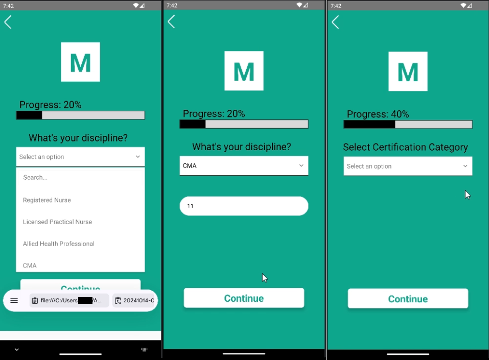
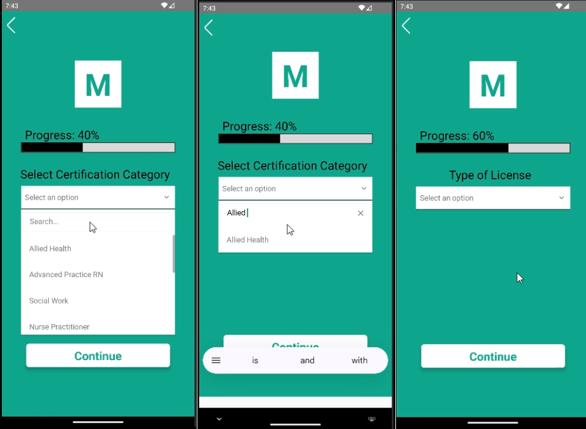
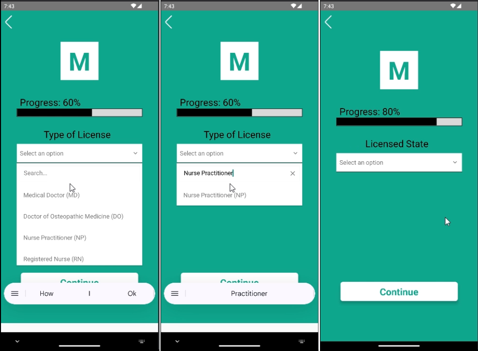
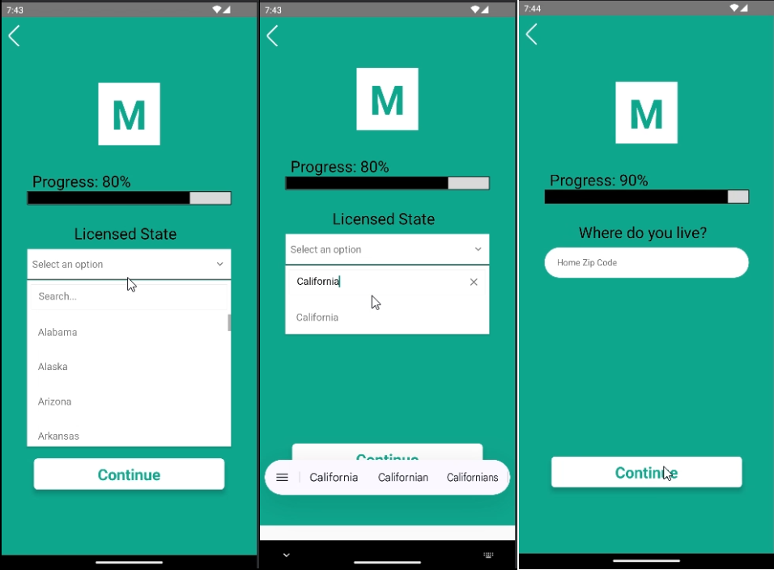
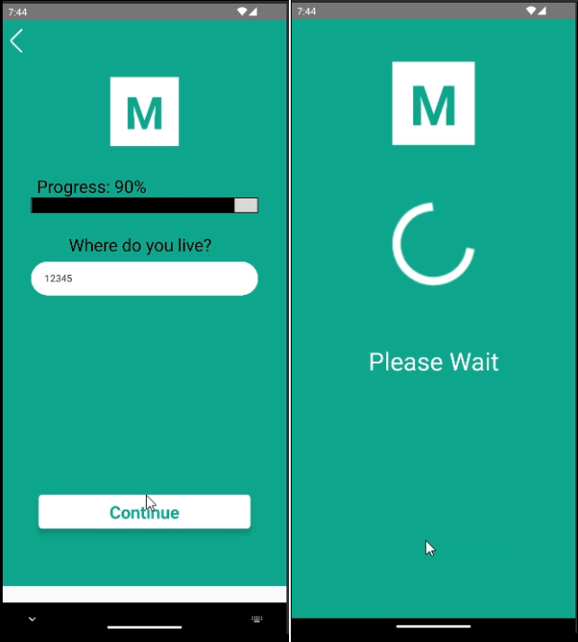
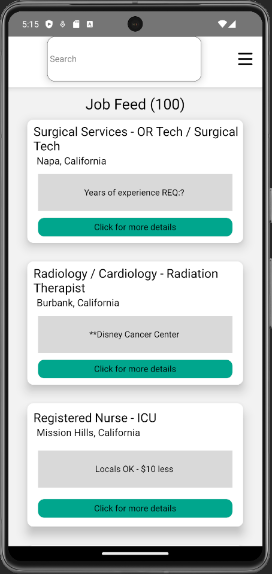
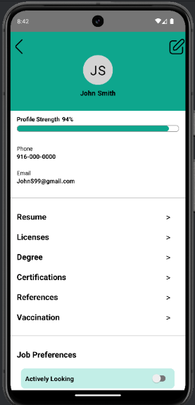
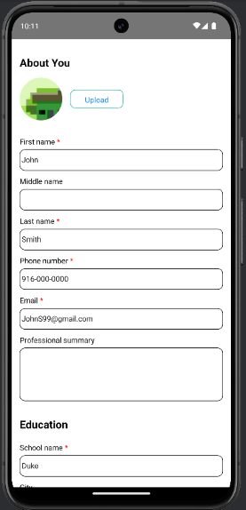

# Medbuzz


# Table of Contents

- [Synopsis](#synopsis)
- [Features](#features)
- [Developer Instructions](#developer-instructions)
    - [Dependencies](#dependencies)
    - [Download](#download)
    - [Setup](Setup)
    - [Deployment](#deployment)
        - [Deployment Keys](#deployment-keys)
- [Testing](#testing)
- [Contributors](#contributors)
- [Special Thanks](#special-thanks)

## Synopsis

MedBuzz is an innovative mobile application developed by Sprint Scripters, aimed at bridging the gap between healthcare workers and recruiters across the United States. This project, guided by the vision of Kamaldeep Singh, Founder, and CEO of Radixsol, promises to automate and streamline the healthcare recruitment process, enhancing the efficiency of job searches, application tracking, and communication between candidates and recruiters.

The Radixsol Medical Staffing App envisions a platform where healthcare professionals can effortlessly connect with recruiters, showcasing their qualifications and easily exploring job opportunities. By integrating advanced features such as online profile creation, a comprehensive job search and filtering system, and real-time notifications, MedBuzz aims to simplify the recruitment process, making it more direct, efficient, and engaging for all stakeholders involved.

## Features

Describe the features of the app.
Include any subsections as needed.

## Developer Instructions

**Requirements:**

- Any text editor/IDE,
- Node.js,
- Git Bash,
- and Android Studio and/or XCode.

### Download

1. Navigate to where you want to save the project, open your terminal there, and enter the following:

```Bash
Git clone https://github.com/JaskirtKaler/Medbuzz.git
```

### Setup

2. Navigate into the `Medbuzz` folder and run the following:

```Bash
cd Mebuzz
npm i
```

3. To run the app:

```Bash
npx react-native start --reset-cache
```

*Note:* `--reset-cache` does not always need to be used, but it is best to run if you change the `.env` file.

4. In a new terminal, run one of the following depending on which system you will use:

**For Android:**

```Bash
npm react-native android
```

**For iOS:**

```Bash
npx react-native run-ios-simulator="iPhone 16 Pro Max"
```

*Note:* You do not have to use the phone listed above. Pick whatever device you need to run/test on.

For iOS, you must run the following in the path `Medbuzz/ios/`:

```Bash
pod install
```

Best practice is to also do `rm—rf build/` and then `xcodebuild clean`, as this will reset the XCode build cache.

### Deployment


#### Deployment Keys

Your deployment keys go into the `.env` file. Be sure to run `npx react-native start --reset-cache` whenever you change the keys.

## Testing

<!-- > Testing Section with links or descriptions of how to test. -->

The MedBuzz app used Jest and Manual Testing to ensure the functionality of the app. Below are the details:

### Types of Testing

1. **Unit Testing**:
   - Used Jest to validate the functionality of isolated components.
   - Components tested include:
     - `EditBasicDetails`
     - `ForgotPassword`
     - `UserLocation`
     - `Certificates`
     - `Discipline`
     - `MessagePage`
     - `MyJobsPage`
     - `ResetPassword`

2. **Integration Testing**:
   - Focused on interactions between multiple components, such as ensuring proper functionality of `MyJobsPage` job feed and navigation.

3. **Manual Testing**:
   - Verified UI responsiveness and navigation using the Android Emulator.
   - Validated key workflows like form submissions and password recovery.

---

### Running Tests

#### Run All Tests

To run all test cases across all components, use the following command:

```bash
npm test
```

## Run Tests for Specific Components

Each test file is dedicated to a specific component. You can run individual test cases using the --testPathPattern flag with the file name. Below are the commands to test individual components:

EditBasicDetails:
```bash
npm test -- --testPathPattern EditBasicDetails.test.tsx
```
ForgotPassword:
```bash
npm test -- --testPathPattern ForgotPassword.test.tsx
```
UserLocation:
```bash
npm test -- --testPathPattern UserLocation.test.tsx
```
Certificates:
```bash
npm test -- --testPathPattern Certificates.test.tsx
```
 Discipline:
 ```bash
npm test -- --testPathPattern Discipline.test.tsx
```
MessagePage:
```bash
npm test -- --testPathPattern MessagePage.test.tsx
```
MyJobsPage:
```bash
npm test -- --testPathPattern MyJobsPage.test.tsx
```
ResetPassword:
```bash
npm test -- --testPathPattern ResetPassword.test.tsx
```

## Contributors

<!-- Include the email you want to be contacted by and your GitHub profile link.-->

- Jaskirt Kaler (jaskirtkaler@csus.edu)
- Ashar Javid (ajavid@csus.edu)
- Alex Muir (alexmuir@csus.edu)
- Maddie Ananda (manandasubramanian@csus.edu)
- Fadi Zubeideh (fzubeideh@csus.edu)
- Richard E. Varela (rvarela@csus.edu)
- Adiba Akter (adibaakter@csus.edu)
- Avneet Brar (avneetbrar@csus.edu)

## Special Thanks

The team would like to thank our client Kamaldeep Singh, the founder of Radixsol and Kenneth Elliot for providing us the opportunity to create this application.

## Software Images

Medbuzz has an easy to use survey when the user signs up for the first time to help guide them through the necessary paper that Radixsol needs to help the user find work.











- - -

The homepage is where the user can see all jobs that meet their preferences.



- - -

The profile page where the user can edit their details, see their profile strength, and upload any necessary files.



- - -

On this page, the user can edit a variety of different kinds of information, such as their name, locations, their profile picture, update their contact information, etcetera.

