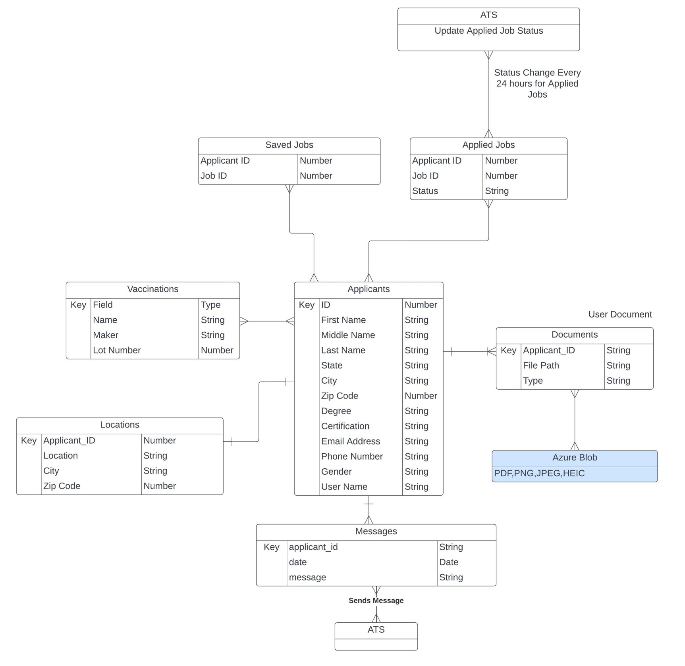

# Medbuzz

## Contributors

- Jaskirt Kaler (jaskirtkaler@csus.edu)
- Ashar Javid (ajavid@csus.edu)
- Alex Muir (alexmuir@csus.edu)
- Maddie Ananda (manandasubramanian@csus.edu)
- Fadi Zubeideh (fzubeideh@csus.edu)
- Richard E. Varela (rvarela@csus.edu)
- Adiba Akter (adibaakter@csus.edu)
- Avneet Brar (avneetbrar@csus.edu)

## Table of Contents

- [Synopsis](#synopsis)
- [Software Images](#software-images)
    - [Entity Relationship Diagram](#entity-relationship-diagram)
    - [Product Mockup Images](#product-mockup-images)
- [Timeline](#timeline)
    - [Sprint 5](#sprint-5-82624---9924)
    - [Sprint 6](#sprint-6-9924---92324)
    - [Sprint 7](#sprint-7-92324---10724)
    - [Sprint 8](#sprint-8-10724---102124)
- [Testing](#testing)
- [Dependencies](#dependencies)
- [Developer Instructions](#developer-instructions)
- [Deployment](#deployment)

## Synopsis

MedBuzz is an innovative mobile application developed by the Sprint Scripters, aimed at bridging the gap between healthcare workers and recruiters across the United States. This project, guided by the vision of Kamaldeep Singh, Founder and CEO of Radixsol, promises to automate and streamline the healthcare recruitment process, enhancing the efficiency of job searches, application tracking, and communication between candidates and recruiters.

The Radixsol Medical Staffing App envisions a platform where healthcare professionals can effortlessly connect with recruiters, showcasing their qualifications and exploring job opportunities with ease. By integrating advanced features such as online profile creation, a comprehensive job search and filtering system, and real-time notifications, MedBuzz aims to simplify the recruitment process, making it more direct, efficient, and engaging for all stakeholders involved.

## Software Images

### Entity Relationship Diagram

### Product Mockup Images

    
    
    

## Timeline

### Sprint 5 (8/26/24 - 9/9/24)

- Integrate new UI Pages: My Jobs, Job Posting, Inbox. 

- Finish integration/functionalities of existing UI Pages 

- Integrate Azure Entra for Login, sign up, and Reset password. 

- Make sure Navigation follows the flow as designed. 

- Define SQL tables and create all tables approved in the ER diagram. 

- Alpha Testing. 

### Sprint 6 (9/9/24 - 9/23/24)

- Fix Alpha Testing Bugs. 

- Set up Azure API Gateway for runtime and application proxying. 

- Connect string and Int data to SQL DB. 

- Integrate the Applicant Tracking System (ATS) into the app to render new job postings. 

### Sprint 7 (9/23/24 - 10/7/24)

- Configure Azure Blob storage for users. 

- Test user data storage and retrieval. 

- Integrate SQL metadata for Azure Blob data. 

- Integrate Guest users and local storage data for search parameters 

- Beta Testing. 

### Sprint 8 (10/7/24 - 10/21/24)

- Integrate Azure Function for messaging system 

- Run Azure Function for users on a 24-hour basis. 

- Sort out Beta Testing Bugs. 

## Testing

<!-- Place holder until 191 -->

## Dependencies

<!-- Place holder until 191 -->

## Developer Instructions

<!-- Place holder until 191 -->

## Deployment

<!-- Place holder until 191 -->
